# job_finder Pipeline Architecture

## Overview

The job_finder project implements a sophisticated multi-tier job discovery and meta-improvement system. This diagram captures the complete flow from user dispatch through feedback loops that feed the next run.

---

## Sequence Diagram

```mermaid
sequenceDiagram
    actor User
    participant Dispatcher as /fetchjobs<br/>Dispatcher
    participant ProfileChk as Profile &<br/>Tier Check
    participant LeanFlow as Lean Variant<br/>(Pro) 
    participant FullOrch as Full Variant<br/>Orchestrator (Max)
    participant ContextTeam as Context Team<br/>(Parallel)
    participant DiscoveryTeam as Discovery Team<br/>(3 Waves)
    participant Scorer as Scoring<br/>Engine
    participant PersistAgent as Persistence<br/>Agent (BG)
    participant Wisdom as Wisdom<br/>Writer (Parallel)
    participant Display as Final Display<br/>& Cleanup
    participant ImproveSkill as /improve<br/>Meta-Skill
    participant Streamlit as Streamlit<br/>Dashboard

    User->>Dispatcher: /fetchjobs (or /fetchjobs-pro)
    activate Dispatcher

    Dispatcher->>ProfileChk: Read candidate_info.json<br/>Check plan_tier
    activate ProfileChk
    ProfileChk-->>Dispatcher: tier: pro/max5x/max20x
    deactivate ProfileChk

    alt plan_tier == "pro" AND no override
        Dispatcher->>LeanFlow: Dispatch to /fetchjobs-pro<br/>(Sonnet 4.6, ~500K tokens)
        activate LeanFlow
        LeanFlow->>ContextTeam: Load profile + resume
        LeanFlow->>DiscoveryTeam: Wave 1,2,3 searches<br/>(description externalizes)
        LeanFlow->>Scorer: Score candidates<br/>(main agent context)
        LeanFlow->>PersistAgent: Hand off scored jobs<br/>(background subagent)
        LeanFlow->>Wisdom: Write wisdom (parallel)<br/>to candidate_info.json
        LeanFlow->>Display: Query DB, format table
        LeanFlow-->>Dispatcher: Return results
        deactivate LeanFlow
    else plan_tier == "max5x"/"max20x" OR override == "full"
        Dispatcher->>FullOrch: Dispatch to Full Flow<br/>(Opus 4.7, ~20M tokens)
        activate FullOrch

        %% Step 1: Context Ingestion (Parallel)
        FullOrch->>ContextTeam: Fire 3 parallel calls
        activate ContextTeam
            ContextTeam->>ContextTeam: Load candidate_info.json
            ContextTeam->>ContextTeam: Parse resume PDF<br/>(Top 3 Achievements)
            ContextTeam->>ContextTeam: Run get_nudge_context.py<br/>(high_signal_jobs)
            ContextTeam->>ContextTeam: Apply exclusion filters<br/>(excluded_companies,<br/>excluded_areas,<br/>excluded_pairs)
        ContextTeam-->>FullOrch: Profile + Context Ready
        deactivate ContextTeam

        %% Step 2-3: Discovery (3 Waves of Parallel Calls)
        FullOrch->>DiscoveryTeam: Discovery Orchestration
        activate DiscoveryTeam
            
            %% Wave 1
            DiscoveryTeam->>DiscoveryTeam: Pre-Wave 1:<br/>Load zero_result_query_strings<br/>from last 2 runs
            DiscoveryTeam->>DiscoveryTeam: Wave 1 — Search Wave<br/>8-10 WebSearch calls<br/>in parallel (golden_keywords,<br/>moat terms, domains,<br/>site:lever.co/greenhouse.io)
            DiscoveryTeam->>DiscoveryTeam: Pre-Wave 2 Filter:<br/>Drop board-page URLs

            %% Wave 2
            DiscoveryTeam->>DiscoveryTeam: Wave 2 — Fetch Wave<br/>6-8 WebFetch calls<br/>in parallel<br/>Extract descriptions,<br/>posted_at dates
            DiscoveryTeam->>DiscoveryTeam: Lever JSON API<br/>conversion: extract createdAt<br/>Greenhouse: rewrite to<br/>job-boards.greenhouse.io<br/>Workday: handle JS renders

            %% Wave 3
            DiscoveryTeam->>DiscoveryTeam: Wave 3 — Backfill<br/>ATS fallback for LinkedIn hits<br/>Aggregator fallback<br/>for Ashby/403s<br/>Domain blind-spot recovery<br/>queries

            DiscoveryTeam->>DiscoveryTeam: Diagnostics:<br/>mcp_websearch_calls,<br/>mcp_webfetch_calls,<br/>mcp_candidates_extracted,<br/>linked_discovered/with_ats/<br/>fallback_only
        DiscoveryTeam-->>FullOrch: All URLs + descriptions
        deactivate DiscoveryTeam

        %% Step 3: Scoring
        FullOrch->>Scorer: Apply Moat-Seeker Logic
        activate Scorer
            Scorer->>Scorer: Read .claude/_scoring_rules.md
            Scorer->>Scorer: Hard filters:<br/>noise_keywords,<br/>excluded_*,<br/>terminal lifecycle status
            Scorer->>Scorer: Score bands:<br/>90-100 (≥3 moat items)<br/>70-89 (core_identity +<br/>engineering/moat)<br/>Soft biases:<br/>inclinations (+5),<br/>disinclinations (-5),<br/>learn_skills (+3)
            Scorer->>Scorer: Vesting bonus:<br/>Series C/D, IPO, grants (+20%)
            Scorer->>Scorer: Confidence cap:<br/>79 if no description
            Scorer->>Scorer: Rationale:<br/>JD phrases, moat fit,<br/>soft-bias matches
        Scorer-->>FullOrch: Scored candidates (score≥70)
        deactivate Scorer

        %% Step 4: Handoff to Persistence Agent
        FullOrch->>PersistAgent: Hand off scored jobs<br/>(background subagent,<br/>non-blocking)
        activate PersistAgent
            PersistAgent->>PersistAgent: Run filter_valid_job_links<br/>HEAD-check URLs<br/>Catch 404, ?error=true,<br/>empty renders, bot walls
            PersistAgent->>PersistAgent: Prune false positives:<br/>Sample prior-pruned links<br/>→ resurrected?<br/>If >5%: emit pruner_fpr_alert,<br/>skip pruning this run
            PersistAgent->>PersistAgent: Call persist_jobs(alive)<br/>→ SQLite DB
            PersistAgent->>PersistAgent: Stale-link pruning<br/>(two-strike protocol):<br/>Mark validation_success<br/>for alive rows<br/>Re-validate old rows<br/>First failure → quarantine<br/>Second failure → delete +<br/>log to pruned_history.jsonl<br/>TTL-expire zombies (30d)
            PersistAgent->>PersistAgent: Emit diagnostics:<br/>Append to<br/>data/run_diagnostics.jsonl<br/>websearch_calls,<br/>webfetch_calls,<br/>valid_jobs,<br/>stale_links_*,<br/>pruner_fpr_alert,<br/>domain_coverage,<br/>score_distribution
        PersistAgent-->>FullOrch: valid_jobs_count,<br/>stale_links_pruned
        deactivate PersistAgent

        %% Step 5-6: Wisdom (Parallel with Persistence)
        FullOrch->>Wisdom: Analyze scored batch<br/>(runs parallel w/<br/>Persistence Agent)
        activate Wisdom
            Wisdom->>Wisdom: Synthesize patterns:<br/>domain mix,<br/>role seniority,<br/>methods,<br/>tooling,<br/>hiring signals
            Wisdom->>Wisdom: Generate 3-6<br/>grounded sentences<br/>or 1-2 if empty
            Wisdom->>Wisdom: Update candidate_info.json<br/>wisdom field only<br/>(preserve all other keys)
        Wisdom-->>FullOrch: Wisdom written
        deactivate Wisdom

        %% Step 9: Final Display
        FullOrch->>Display: Wait for Persistence Agent
        activate Display
            Display->>Display: Query live DB<br/>ORDER BY first_seen DESC
            Display->>Display: Split into 3 groups:<br/>Group 1: Found this run<br/>Group 2: Active applications<br/>(status IN Applied/...<br/>Won)<br/>Group 3: Earlier runs
            Display->>Display: Render markdown table<br/>Status badge | Score |<br/>Company | Title | Theme |<br/>Posted | Link<br/>(render posted_at as<br/>YYYY-MM-DD, first_seen<br/>same, NULL → em-dash)
            Display->>Display: Print final counts:<br/>final_table_total,<br/>final_table_this_run,<br/>final_table_active_applications<br/>(by status), earlier
            Display->>Display: Write session marker<br/>data/last_session.json
            Display->>Display: Backfill token diagnostics<br/>via audit_run_efficiency.py
        Display-->>FullOrch: Table printed, marker written
        deactivate Display

        FullOrch-->>Dispatcher: Complete
        deactivate FullOrch
    end

    deactivate Dispatcher

    %% Post-Run Auto-Improve
    note over ImproveSkill: Step 10: Auto-Audit<br/>/improve (optional)
    alt auto_improve_enabled == true
        User->>ImproveSkill: /improve --auto
        activate ImproveSkill
            ImproveSkill->>ImproveSkill: Phase 0:<br/>Skill cache check<br/>(scripts/skill_cache.py)
            ImproveSkill->>ImproveSkill: Phase 1:<br/>Ingest evidence<br/>run_diagnostics.jsonl,<br/>improve_log.jsonl,<br/>candidate_info.json
            ImproveSkill->>ImproveSkill: Phase 1.5:<br/>Run efficiency audit<br/>audit_run_efficiency.py<br/>→ /tmp/improve_audit.json<br/>(tokens, latency, waste)
            ImproveSkill->>ImproveSkill: Phase 1.7:<br/>Feedback synthesis<br/>synthesize_feedback_patterns.py<br/>→ PATTERN_* hypotheses
            ImproveSkill->>ImproveSkill: Phase 2-3:<br/>Compute trends,<br/>detect pain points<br/>(SEARCH_TOO_NARROW,<br/>LOW_YIELD, SKILL_TOKEN_BLOAT,<br/>WASTED_FETCH_RATE,<br/>TOKENS_PER_VALID_JOB_HIGH,<br/>PATTERN_INCLINATION_FOUND, etc.)
            ImproveSkill->>ImproveSkill: Phase 4:<br/>Walk Tier 1-4 compaction<br/>candidates + pain-point<br/>proposals
            ImproveSkill->>ImproveSkill: Auto-revert<br/>candidates:<br/>Compare current run<br/>priors (valid_jobs,<br/>pct_high_score)<br/>w/ pre-metrics on<br/>previously-applied changes<br/>If regression<br/>(< 0.85× prior):<br/>Call revert_change(id)
            ImproveSkill->>ImproveSkill: Apply Tier 1-4<br/>auto-apply candidates<br/>via apply_proposal(id,<br/>approved_by='auto',<br/>pre_metrics=...)
            ImproveSkill->>ImproveSkill: Stage PATTERN_*/SCORING_DRIFT<br/>to Streamlit<br/>(human review)
            ImproveSkill->>ImproveSkill: Print Auto Summary<br/>Reverted: N changes<br/>Applied: N tiers<br/>Bytes reclaimed<br/>Staged for review
        ImproveSkill-->>User: /improve --auto complete
        deactivate ImproveSkill
    else auto_improve_audit_enabled == true
        User->>ImproveSkill: /improve --audit-only
        activate ImproveSkill
            ImproveSkill->>ImproveSkill: Phases 0-3:<br/>same as above
            ImproveSkill->>ImproveSkill: Phase 4 (audit-only):<br/>DO NOT apply<br/>Write proposals to<br/>data/improve_proposals.jsonl<br/>via write_proposal()
            ImproveSkill-->>User: N proposals staged
        deactivate ImproveSkill
    end

    %% Feedback Loop
    note over Streamlit: Streamlit Dashboard
    User->>Streamlit: Review pending proposals<br/>(PATTERN_*,<br/>SCORING_DRIFT,<br/>COMPACTION_PLAN,<br/>etc.)
    Streamlit->>Streamlit: User marks job status:<br/>Applied, InProgress,<br/>Closed, Won, NotForMe
    Streamlit->>Streamlit: User approves proposals<br/>or clicks Restore
    Streamlit->>ImproveSkill: /improve --apply <change_id><br/>or<br/>/improve --restore <change_id>
    ImproveSkill->>ImproveSkill: apply_proposal(id) or<br/>revert_change(id)
    ImproveSkill->>ImproveSkill: Edit files, write<br/>data/improve_changes.jsonl
    ImproveSkill-->>Streamlit: Change applied/reverted

    %% Next Run
    Streamlit-->>User: Dashboard updated
    User->>Dispatcher: /fetchjobs (next run)
    note over User,Display: Feedback loop closes:<br/>Wisdom from prior run<br/>High-signal jobs influence queries<br/>Applied compactions reduce token cost<br/>Reverted changes restore quality
```



---

## Phase Breakdown

### Phase 0: Variant Dispatch
- **Entry point:** User invokes `/fetchjobs`
- **Decision logic:** 
  - Read `data/candidate_info.json` for `plan_tier` and `runtime_mode_override`
  - If `pro` tier and no override: ask user, recommend Lean (doesn't exceed 5-hour window)
  - If `max5x`/`max20x` or override set: use choice directly
- **Outcome:** Route to Lean (fetchjobs-pro) or Full (Opus) variant

### Phase 1: Context Ingestion (Context Team)
- **Execution:** Three parallel tool calls in single message
- **Tasks:**
  1. Load active profile JSON with all fields: core_identity, scientific_moat, engineering_stack, target_seniority, golden_keywords, noise_keywords, priority_domains, search_targets, exclusion lists
  2. Parse resume PDF (extract Top 3 Achievements)
  3. Run `scripts/get_nudge_context.py` to fetch high_signal_jobs with user weights
- **Filters applied:** exclusion_companies, excluded_areas, excluded_pairs (hard filters, applied before scoring)
- **Nudge amplification:** For each high-signal job (weight ≥70), add dedicated Wave 1 query targeting its theme
- **Output:** Context ready for discovery

### Phase 2-3: Vectorized Discovery (Discovery Team — 3 Waves)

#### Wave 1 — Search Wave
- Zero-result avoidance: Load previous 2 runs' failed queries from diagnostics, broaden any repeats
- 8-10 parallel WebSearch calls using:
  - Golden_keywords + moat terms + engineering_stack + priority_domains
  - Site targets: `site:lever.co`, `site:job-boards.greenhouse.io`, `site:myworkdayjobs.com`, `site:linkedin.com/jobs`
  - Recency tokens: "2026", "Hiring Now", country target
- Pre-Wave 2 URL filter: Drop board-page patterns (paths ending in /jobs, /openings; query-only ?q=, ?keyword=, etc.)
- **Output:** Raw candidate URLs

#### Wave 2 — Fetch Wave
- 6-8 parallel WebFetch calls on surviving URLs
- Lever API conversion: `jobs.lever.co/{company}/{id}` → `api.lever.co/v0/postings/{company}/{id}?mode=json` (extract `createdAt` → `posted_at`)
- Greenhouse pre-canonicalization: rewrite `boards.greenhouse.io` → `job-boards.greenhouse.io` (avoid redirect tax)
- Extract descriptions + posted_at (best-effort per source reliability: Lever API > Greenhouse > Workday > Aggregators)
- **Output:** Candidate descriptions + posting dates

#### Wave 3 — Backfill Wave
- ATS fallback for LinkedIn hits (search `"[company]" "[title]" site:lever.co OR site:greenhouse.io`)
- Aggregator fallback for Ashby/403s (`site:builtin.com OR site:simplify.jobs`)
- Domain blind-spot recovery: For any priority_domain with 0 candidates after Wave 2, run broad targeted query
- **Output:** Remaining descriptions + backfill candidates

### Phase 3: Scientific Moat Evaluation
- **Scoring logic:** Read `.claude/_scoring_rules.md` (canonical)
- **Hard filters first:**
  - Drop noise_keywords matches
  - Drop excluded_companies (case-insensitive exact)
  - Drop excluded_areas (case-insensitive substring of theme)
  - Drop excluded_pairs (company:area both sides match)
  - Drop terminal lifecycle status (Applied, InProgress, Closed, Won, NotForMe)
- **Score bands:**
  - 90-100: ≥3 scientific_moat items found in description
  - 70-89: core_identity + (≥2 engineering_stack OR ≥1 scientific_moat)
  - <70: dropped
- **Soft biases:** +5 if inclinations match, -5 if disinclinations match, +3 if learn_skills match (scaled by confidence)
- **Vesting bonus:** 1.2× for Series C/D, IPO-bound, NIST/DOE grants
- **Confidence cap:** 79 if description unavailable
- **Output:** Candidates with score + detailed rationale (citing JD phrases, moat fit)

### Phase 4: Scoring Handoff
- **Note:** Live-link validation **delegated to Persistence Agent** (not in main context)
- Forward only score ≥ 70 + not filtered by exclusions
- Include fetched description text on each job dict (for future feedback analysis)
- Print: scored_candidates_count, top-3 sample
- Hand full scored list to background Persistence Agent (non-blocking)

### Phase 5: Persistence Agent (Background Subagent)
- **Non-blocking:** Main agent proceeds to Step 6 immediately
- **Tasks:**
  1. **Live-link validation:** Call `filter_valid_job_links(jobs, require_title_in_body=True, check_content=True)`
     - Catches: HTTP non-2xx, `?error=true` redirects, final URL no longer matching job ID, bot interstitials, empty renders, DEAD_PAGE_PHRASES
  2. **Pruner false-positive check:** Sample 10 prior-pruned links, HEAD-check them. If >5% alive: emit `pruner_fpr_alert`, skip pruning this run
  3. **Persist:** Call `persist_jobs(alive)` → SQLite (only live rows)
  4. **Stale-link pruning (two-strike):**
     - Mark validation_success on alive rows (reset counter)
     - Re-validate old rows: first failure → quarantine (status='quarantine'); second failure → delete + log to `pruned_history.jsonl`
     - TTL-expire zombies older than 30 days
  5. **Diagnostics:** Append JSON line to `data/run_diagnostics.jsonl` with all metrics (websearch_calls, valid_jobs, domain_coverage, score_distribution, etc.)
- **Output:** valid_jobs_count, stale_links_pruned

### Phase 6: Wisdom Loop (Parallel with Persistence Agent)
- **Runs in parallel:** main agent does not wait
- **Tasks:**
  1. Analyze entire scored batch: domain mix, role seniority, methods, tooling, hiring patterns
  2. Generate 3-6 grounded sentences (or 1-2 if empty with explicit reason + next-step suggestion)
  3. Update `candidate_info.json`: write `wisdom` field only, preserve all other keys
- **Output:** Updated profile

### Phase 9: Final Display & Cleanup
- **Wait for Persistence Agent** to complete (stale-link pruning must finish before display)
- **Query live DB:** `ORDER BY (first_seen IS NULL), first_seen DESC, score DESC, company ASC`
- **Split into 3 sections:**
  1. **Found this run:** link in current-run set, not in terminal status
  2. **Active applications:** status in (Applied, InProgress, Closed, Won) — REQUIRED section even if empty
  3. **Earlier runs:** everything else alive
- **Render markdown table:**
  - Columns: Status badge (🟢 Won, 🔵 InProgress, 🟡 Applied, ⚪ Closed, ⚠ Quarantine, empty for New), Score, Company, Title, Theme (truncated), Posted (YYYY-MM-DD or —), Link
  - Truncate Title to 60 chars, Theme to 30 chars
- **Print final counts:** final_table_total, final_table_this_run, final_table_active (by status), earlier, pruned_this_run, posted_at_coverage
- **Write session marker:** `data/last_session.json` (used by audit script to find this run's transcript)
- **Backfill token diagnostics:** Run `audit_run_efficiency.py` → patch diagnostics line with actual input/output/cache/productive/lost tokens

### Step 10: Auto-Improve (Optional)
Runs at end of `/fetchjobs` if `auto_improve_enabled` or `auto_improve_audit_enabled` is set in profile.

**`--auto` mode (autonomous):**
1. Run Phase 0: skill cache check
2. Run Phases 1-3: ingest diagnostics, run efficiency audit, synthesize feedback patterns, detect pain points
3. Phase 4 (auto-specific):
   - Check auto_revert_candidates: any applied change whose post-metrics regressed? Call `revert_change(id)`
   - Walk Tier 1-4 compaction candidates: auto-apply via `apply_proposal(id, approved_by="auto", pre_metrics=...)`
   - Stage PATTERN_* / SCORING_DRIFT to Streamlit (NOT auto-applied — behavior change, needs human approval)
4. Print Auto Summary: reverted count, applied tiers + bytes reclaimed, staged count

**`--audit-only` mode (review):**
1. Phases 0-3: same as above
2. Phase 4: write proposals to `data/improve_proposals.jsonl` (do NOT apply)
3. Print: "N proposals staged — review in Streamlit"

### Pain Points Detected (Sample)
- `SEARCH_TOO_NARROW`: zero-result query rate too high → broaden queries
- `LOW_YIELD`: avg_valid_jobs < 5 → expand search_targets or golden_keywords
- `SKILL_TOKEN_BLOAT`: skill file > 10KB → compress prose, externalize examples
- `WASTED_FETCH_RATE`: >30% of fetches are redirects/board-pages → optimize URLs
- `TOKENS_PER_VALID_JOB_HIGH`: efficiency ratio > 1.5× prior → reduce context bloat
- `PATTERN_INCLINATION_FOUND`: high-signal jobs share a domain/skill → add to `inclinations`
- `SCORING_DRIFT_DETECTED`: system surfaced high-scored jobs user explicitly rejected → retune moat thresholds
- `REGRESSION_DETECTED`: applied change caused valid_jobs to drop ≥15% → auto-revert via safety net

### Feedback Loop (Closing)
1. User applies job actions in Streamlit: status updates (Applied, Won, NotForMe)
2. User approves/rejects proposals from /improve
3. On next `/fetchjobs`:
   - Wisdom from prior run + high-signal jobs from Streamlit inform discovery queries
   - Applied compactions reduce token cost while maintaining quality (regression guard reverts failures)
   - Updated inclinations/disinclinations bias scoring without hard-filtering
4. System improves iteratively across runs, token cost trends downward (compaction), quality holds (regression safety net)

---

## Key Design Patterns

### 1. **Parallel execution where possible**
- **Context Team** (Step 1): 3 tool calls fire simultaneously
- **Discovery Waves**: Within each wave, all calls are parallel; waves are sequential (Wave 2 depends on Wave 1 output)
- **Persistence + Wisdom** (Steps 5-6): Non-blocking subagent + main-agent work in parallel

### 2. **Live-link validation delegated to background**
- Avoids pulling 10+ WebFetch payloads into main context (token preservation)
- Persistence Agent runs `filter_valid_job_links` in Python (catchier than WebFetch ad-hoc checks)
- Stale-link pruning happens after, keeping main agent unblocked

### 3. **Structured error protocol**
- All pain-point proposals carry `{type, severity, evidence, file_changed, patch, summary}`
- Changes logged atomically to `data/improve_changes.jsonl` with pre_metrics + restore_manifest
- Regressions caught by comparing post-run efficiency against priors (valid_jobs, pct_high_score down >15% = auto-revert)

### 4. **Tier-aware auto-apply with safety net**
- Tier 1 (inline transforms): lossless by construction, auto-apply
- Tier 2-4 (archiving, dedup): auto-apply BUT pre_metrics written; next-run regression check triggers auto-revert
- PATTERN_* / SCORING_DRIFT: behavior-changing, staged to Streamlit (human approval required)

### 5. **Continuous compaction without threshold gates**
- Every `/improve` cycle walks all 4 tiers; if ANY candidate exists, `SKILL_COMPACTION_PLAN` fires (not suppressed by cost)
- Contract: `total_skill_bytes` and `main_tokens` trend downward across runs, until headroom exhausted
- Restore command available for any applied change, making aggressive compaction reversible

### 6. **Lifecycle disentanglement**
- Applied/InProgress/Closed/Won jobs are life-events (not quality signal)
- Scoring drift only counts "high-score + explicit rejection" (user_feedback='bad' or weight≤30)
- Step 9 display separates "Found this run" (new candidates) from "Active applications" (user's live set)

---

## Token Preservation Tactics

1. **Descriptions externalized** (Lean variant): `data/_descriptions/` directory, fetched on-demand
2. **Diagnostics in Python** (Persistence Agent): stale-link pruning, link validation run in native code
3. **Skill cache** (Phase 0): hash-check skill files; re-read only on change
4. **Audit script** (Phase 1.5): computes efficiency metrics in Python, returns JSON summary
5. **Feedback synthesizer** (Phase 1.7): outputs LLM prompt template in JSON; you execute the prompt (not embedded in 100KB context)

---

## File Structure Referenced

```
data/
  candidate_info.json          # Profile (plan_tier, runtime_mode_override, wisdom, etc.)
  run_diagnostics.jsonl        # Metrics per run (websearch_calls, valid_jobs, etc.)
  improve_log.jsonl            # History of approved changes
  improve_proposals.jsonl      # Proposals staged for Streamlit review
  improve_changes.jsonl        # Applied changes + restore_manifest
  pruned_history.jsonl         # Deleted jobs + reason
  last_session.json            # Session ID + JSONL paths (audit marker)
  sovereign_agent.db           # SQLite: jobs table (company, title, score, link, status, first_seen, posted_at)
  history/
    jobs_history.db            # Append-only snapshots
  fpr_recheck_latest.json      # Pruner false-positive check result
  _descriptions/
    *.txt                       # Externalized job descriptions (Lean variant)

.claude/
  commands/
    fetchjobs.md               # Full (Max-tier) flow — Opus 4.7, ~20M tokens
    fetchjobs-pro.md           # Lean (Pro-tier) flow — Sonnet 4.6, ~500K tokens
    improve.md                 # Meta-skill: audit + pain-point detection + apply
    setup.md                   # Profile initialization from resume
  _scoring_rules.md            # Canonical scoring logic (read by Step 3)
  _archive/
    improve__*.md              # Cold sections from compaction

.cursor/
  skills/
    godmode-improve/SKILL.md   # /improve implementation details
    validate-job-links/
    leverage-feedback-and-weights/
    discover-linkedin-jobs/
  rules/
    jobsearch.mdc              # Cursor IDE rules

scripts/
  get_nudge_context.py         # Fetch high-signal jobs
  audit_run_efficiency.py      # Compute token/latency metrics
  synthesize_feedback_patterns.py # LLM hypothesis generator
  audit_feedback_efficacy.py   # Compute positive/negative followup rates
  skill_cache.py               # Hash-check + summarize skill files
  audit_run_efficiency.py       # Token attribution + waste buckets
  session_marker.py            # Write data/last_session.json

src/job_finder/
  persistence.py               # persist_jobs, mark_validation_*, filter_valid_job_links
  link_validation.py           # Dead-link detection
  improve_changes.py           # write_proposal, apply_proposal, revert_change
  session_marker.py            # Session metadata
```

---

## Summary

The job_finder pipeline is a **layered, feedback-driven system**:

1. **Dispatch layer** (tier-aware): Choose Lean or Full based on plan_tier
2. **Discovery layer**: 3 waves of MCP searches + fetches, progressively refined
3. **Scoring layer**: Hard filters (exclusions) + soft biases (moat, inclinations, learn_skills)
4. **Persistence layer**: Live-link validation + stale-link pruning (two-strike) + diagnostics
5. **Wisdom layer**: Synthesis of run patterns → update profile
6. **Display layer**: Recency-grouped table with lifecycle disentanglement
7. **Meta-improvement layer**: `/improve` audit + pain-point detection + auto-apply with safety net
8. **Feedback loop**: Streamlit dashboard → user actions → next run (nudge amplification, compaction applied, regressions reverted)

All layers preserve tokens (parallel execution, background subagents, Python-native heavy lifting) while maintaining quality (regression safety net, two-strike pruning, human approval gates on behavior-changing proposals).

