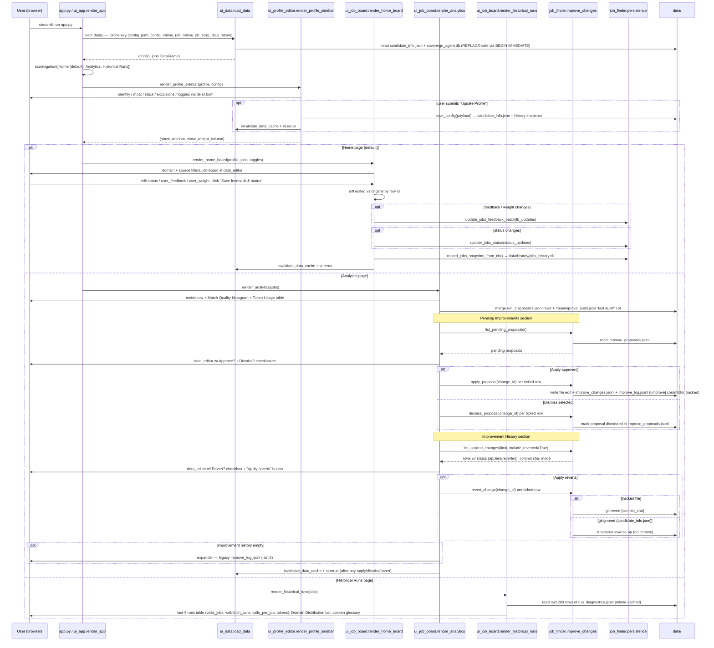
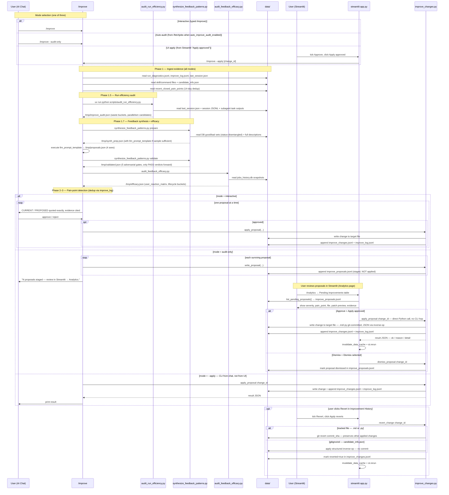
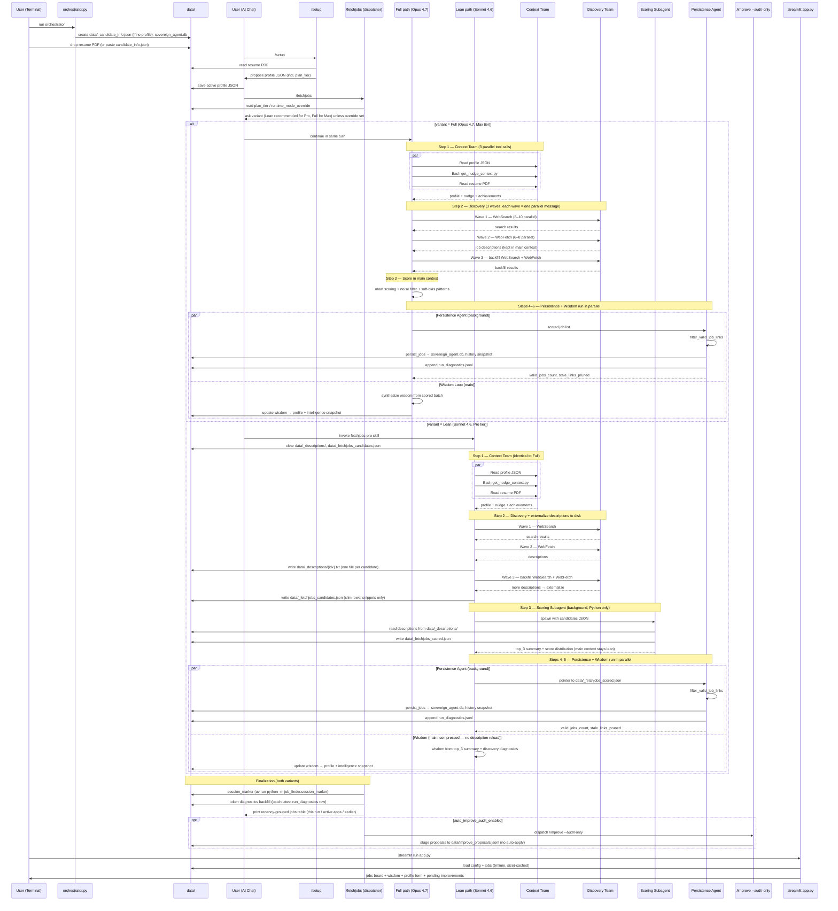

# Career Command Center

Standalone, self-sufficient autonomous job-search package. Follow the steps below. Use **terminal** for the orchestrator and app; use **AI Chat** (Claude Code) for setup and job search.

🎙️ **[Listen to the 90-second intro](assets/command_center_voice_over.mp3)** — what this is and how it works.

---

## Table of Contents

- [Workflow: How To Run?](#workflow)
- [Streamlit UI](#streamlit-ui)
- [/improve — self-tuning loop](#improve-loop)
- [Project Layout: Key Components](#project-layout)
  - [Key components](#project-layout)
  - [Candidate profile JSON](#candidate-profile-json)
  - [Sequence](#flow-sequence)
- [Maintenance/Troubleshooting: after-setup + snapshot history + resetting](#maintenance)
  - [Maintenance/Troubleshooting: After setup](#after-setup)
  - [Maintenance/Troubleshooting: Snapshot history](#snapshot-history)
  - [Maintenance/Troubleshooting: Resetting](#resetting)
- [How to distribute](#how-to-distribute-this-repo)

## <a id="workflow"></a>Workflow: How To Run?

Quick clickable guide: [How to Run](./HOW_TO_RUN.md)

### 1. Initialize the environment (terminal)

In the **system terminal** (not the AI chat window), from the project root run:

```bash
python3 orchestrator.py
```

Or with **uv**:

```bash
uv run python orchestrator.py
```

This creates `data/`, an empty **`data/candidate_info.json`** template (only if no profile file exists yet), and the jobs database. **Safe to run multiple times:** existing profile JSON and DB data are not overwritten.

### 2. Drop resume

Place the resume PDF in the `data/` folder. Use any filename that **contains "resume"** (e.g. `data/resume.pdf`, `data/My_Resume.pdf`). Only PDFs whose name includes "resume" are used for setup.

### 3. Run one-time Setup (infer profile) — AI Chat

**In Cursor:** Open Cursor Chat (Cmd+L / Ctrl+L) and type **`/setup`**. The agent will read the resume, infer the profile, and show proposed JSON for approval. Save to `data/candidate_info.json` (preferred).

**In Claude Code:** Type **`/setup`** in the chat. The agent will read the resume, infer the profile, and show proposed JSON for approval. Save to `data/candidate_info.json`. Do not run the job search until the user has confirmed the config.

**Alternative:** Skip LLM setup and **copy the JSON** into `data/candidate_info.json` (see schema in the setup rule).

### 4. Run the search — AI Chat

**In Cursor:** Type **`/fetchjobs`**.

**In Claude Code:** Type **`/fetchjobs`** in the chat.

#### Variant dispatch (Lean vs Full) — asked at the top of every run

`/fetchjobs` opens with a tier-aware dispatcher that lets you pick a variant for THIS run:

| Variant | Model | Per-run cost | Best for |
|---------|-------|--------------|----------|
| **Lean** | Sonnet 4.6 | ~10 turns, ~500K tokens | Pro plan (fits a 5-hour rate-limit window). Also good for Max users who want a cheap quick run. |
| **Full** | Opus 4.7 | ~150 turns, ~20M tokens | Max 5x / Max 20x plan. Verbose chat, full description corpus loaded for scoring + wisdom. |

The dispatcher asks once for `plan_tier` (`Pro` / `Max 5x` / `Max 20x`) and saves it to `candidate_info.json`. On every subsequent `/fetchjobs`, it asks which variant to run, with the *recommended* option (Lean for Pro, Full for Max) listed first. Both variants share the same DB schema, Persistence Agent, diagnostics, and Step 9.f token backfill — only the discovery and scoring path differs.

**Skip the prompt:** set `"runtime_mode_override": "lean"` (or `"full"`) in `candidate_info.json` and the dispatcher honors it silently every run.

**Direct invocation:** anyone can type **`/fetchjobs-pro`** to invoke the Lean variant directly, bypassing the dispatcher. The Lean variant lives in `.claude/commands/fetchjobs-pro.md` and externalizes every fetched job description to `data/_descriptions/{idx}.txt`, then hands a Scoring Subagent (background, Python-only) the candidate list — the main agent never re-reads the description corpus, which is what makes Lean so much cheaper.

#### Under the hood — the unchanged "orchestrator + agent teams" model

`/fetchjobs` (Full) runs as an orchestrator + agent teams for speed:

- **Context Team** — profile, nudge context, and resume PDF loaded as 3 parallel tool calls.
- **Discovery Team** — all WebSearch and WebFetch calls fire in parallel waves (Search Wave → Fetch Wave → Backfill Wave). WebSearch/WebFetch cannot be delegated to subagents and always run in the main turn.
- **Persistence Agent** (background subagent) — after scoring, validates links, persists jobs, and emits diagnostics while the main orchestrator writes wisdom in parallel.

`/fetchjobs-pro` (Lean) adds two extra agents in the same model: description externalization in the main turn (descriptions written to `data/_descriptions/`), then a **Scoring Subagent** (background, Python only) that reads those files in isolation and writes `data/_fetchjobs_scored.json`. The main agent receives only a top-3 summary — keeping its context lean across the scoring/wisdom turns where the Full variant burns ~17M tokens re-reading descriptions.

Both variants log:
- `linkedin_discovered`
- `linkedin_with_ats`
- `linkedin_fallback_only`
- `linkedin_dropped_reason_counts`

### 4b. Listing URL validation (trust model)

- **Automatic (happens during `/fetchjobs`, no extra user action):** `filter_valid_job_links()` checks each candidate URL immediately before `persist_jobs()`. Checks: HTTP status (`2xx` ok; `404`/`410` terminal-drop; `403`/`408`/`425`/`429`/`5xx` treated as **transient** and the row is kept alive with a `link_validation_transient` marker so a momentary bot-block or rate-limit doesn't prune a live listing), minimum body size, two-tier dead-page phrase match (one **strong** phrase like *"this position is no longer"* is sufficient; otherwise ≥2 distinct **generic** phrases are required), and title echo on non-LinkedIn boards. See **`src/job_finder/link_validation.py`**.
- **Automatic (agent audit when needed):** **`.cursor/skills/validate-job-links/SKILL.md`** — MCP web fetch + redirect/title checks for ambiguous cases. The user does not run this manually; the agent uses it internally when it decides it needs stricter verification.
- **Automatic LinkedIn retrieval path:** **`.cursor/skills/discover-linkedin-jobs/SKILL.md`** — dedicated high-precision query templates, strict LinkedIn URL filtering, login-wall/interstitial handling, confidence tiers, and ATS backfill (company+title → direct Lever/Greenhouse/Ashby/Workday link).

### 5. View and edit (terminal)

```bash
uv run streamlit run app.py
```

See **[Streamlit UI](#streamlit-ui)** below for what the app shows and what to click.

### 6. Self-tune the system

After ~3 successful `/fetchjobs` runs, type **`/improve`** in chat. It audits the per-run
diagnostics, detects pain points (search too narrow, link validation too aggressive,
scoring drift, feedback patterns…), and proposes one human-approved edit at a time. See
**[/improve — self-tuning loop](#improve-loop)**.

---

## <a id="streamlit-ui"></a>Streamlit UI

The app is a three-page Streamlit dashboard wired to `data/sovereign_agent.db` and
`data/run_diagnostics.jsonl`.

**Performance:** the jobs DB and config JSON are cached via `@st.cache_data`
(`src/job_finder/ui_data.py`). The cache key is an `(mtime, size)` fingerprint
of `data/sovereign_agent.db` plus the mtime of the active config — using the size
in addition to mtime defends against sub-second writes that share an mtime tick.
Typing into the sidebar no longer re-reads the DB; the profile is in an `st.form`
so a full rerun fires only when you click **Update Profile**. The
`run_diagnostics.jsonl` reads are also mtime-cached. Saving feedback writes only
**changed** rows (diff against the cached frame), so a 500-row board still saves
in one round-trip.

**Concurrency:** `persist_jobs` wraps each per-row read-modify-write in an
explicit `BEGIN IMMEDIATE` SQLite transaction (`isolation_level=None`) so a
`/fetchjobs` run that lands at the same instant as a UI edit blocks at the
SELECT step instead of clobbering `user_feedback` / `user_weight` / `status`
on its REPLACE. The connection also opens with `timeout=30.0` so brief lock
contention waits rather than erroring out.

### Pages

| Page | What's there |
|------|--------------|
| **Home** | Filter (domain, source) → job board (`st.data_editor`) → **Save feedback & status** button. |
| **Analytics** | Totals, high-moat count, average score, Match Quality histogram, per-run **Token Usage** table (Input/Output/Cache/Productive/Lost), latest `/improve` actions. |
| **Historical Runs** | Last 5 `/fetchjobs` runs (`valid_jobs`, `webfetch_calls`, `calls_per_job`, token columns), Domain Distribution bar, column glossary. |

### Sidebar

- Strategic Pitch, Scientific Moat (comma-sep), Engineering Stack, Target Seniority, Target Country.
- Search Keywords (`golden_keywords`), Noise Keywords, Priority Domains, Search Targets / ATS sites.
- **Exclusions** expander: `excluded_companies` (exact), `excluded_areas` (substring on theme), `excluded_pairs` (`company:area` AND-match). Enforced both at `/fetchjobs` Step 3 and as a backstop in `persist_jobs`.
- **Update Profile** (writes to active `candidate_info.json` via `save_config`, snapshots, invalidates the data cache).
- **Market Intelligence** toggle and **Weight column** toggle.

### Job board columns

| Column | Edit? | Purpose |
|--------|-------|---------|
| `company`, `title`, `score`, `theme`, `rationale` | no | discovery output |
| `source` | no | derived from `link` |
| `link` | no | clickable listing URL |
| **`status`** | yes | application lifecycle — `New` / `Applied` / `InProgress` / `Closed` / `Won` / `NotForMe`. Applied/InProgress/Closed/Won stay POSITIVE-GENRE (next `/fetchjobs` keeps nudging toward similar roles). `NotForMe` is NEGATIVE-GENRE. |
| **`user_feedback`** | yes | `Good` / `Bad` / `—` — genre preference, independent of lifecycle. |
| **`user_weight`** | yes (toggleable) | 0–100 per-row weight used by the next run. |

Click **Save feedback & status** — the diff is persisted via
`update_jobs_feedback_batch` + `update_jobs_status`, a jobs snapshot is appended, and
the data cache is invalidated so the page re-renders fresh state.

### Streamlit UI sequence



---

## <a id="improve-loop"></a>/improve — self-tuning loop

`/improve` is the meta-skill that closes the loop on the rest of the system. It runs
six phases, each grounded in a recorded artifact:

1. **Ingest evidence** — reads `data/run_diagnostics.jsonl` (per-run telemetry written
   by `/fetchjobs`), `data/improve_log.jsonl` (history of prior changes),
   `data/last_session.json` (Claude Code transcript pointer).
2. **Run efficiency audit** — `uv run python scripts/audit_run_efficiency.py` attributes
   WebFetch waste (redirect tax, board returns, JS-empty Workday pages, pre-known
   dead URLs) and computes parallelism candidates.
3. **Feedback synthesis** — `scripts/synthesize_feedback_patterns.py prepare` builds a
   status-disentangled good/bad set (Applied-then-Closed stays POSITIVE-GENRE), the LLM
   proposes hypotheses across company/skill/domain/problem_type axes, then `validate`
   runs five adversarial gates (citation, counter-evidence, ≥80% confounding).
4. **Idempotency** — pain points approved in the last 14 days are suppressed unless
   evidence has worsened ≥10% (`data/improve_log.jsonl`).
5. **Proposals** — one at a time, with `CURRENT`/`PROPOSED` quoted exactly. Pain-point
   IDs include `SEARCH_TOO_NARROW`, `LINK_VALIDATION_AGGRESSIVE`, `BOARD_PAGE_LEAKAGE`,
   `SCORING_DRIFT_DETECTED`, `PATTERN_INCLINATION_FOUND`, `WASTED_FETCH_RATE`,
   `PRUNER_FPR_ALERT`, etc. Every proposal requires explicit human approval; nothing
   auto-applies.
6. **Apply + log** — approved edits are written, then appended to `data/improve_log.jsonl`.

The full spec lives in `.claude/commands/improve.md`. To run it: type **`/improve`** in
Claude Code chat. The Analytics page surfaces the most recent entries from
`data/improve_log.jsonl`.

### Auto-audit + UI approval (recommended)

You don't have to type `/improve` after every `/fetchjobs`. Enable the **Auto-improve audit after each /fetchjobs** toggle in the Streamlit sidebar (saves to `candidate_info.json`). After every `/fetchjobs` run, the agent dispatches `/improve --audit-only` automatically:

1. The audit detects pain points exactly like the interactive mode (same dedup, same gates).
2. Each surviving proposal is staged to `data/improve_proposals.jsonl` — **nothing is applied**.
3. The Streamlit **Analytics → Pending Improvements** table shows every proposal with its evidence, target file, and the exact change preview.
4. Tick **Approve?** on the rows you want, click **Apply approved**. Tracked files (`.md`, `.py`) get a `[improve]` git commit; gitignored files (`data/candidate_info.json`) use a structured inverse-operation revert (no commit).
5. Below it, **Improvement History** lists everything applied. Tick **Revert?** and click **Apply reverts** — partial reverts preserve other applied changes by construction.

The constitutional rule stays intact: **nothing auto-applies**. Audit is automatic; approval is always you.

### /improve sequence



---

## <a id="project-layout"></a>Project Layout: Key Components

| Path | What it’s for | Who is responsible |
|------|------------------|---------------------|
| `orchestrator.py` | Initializes `data/` and creates the jobs DB (if missing). | **User runs once** at the start (or after a reset). |
| `reset.py` | Clears config/jobs/snapshot history; writes a fresh empty `data/candidate_info.json`. | **User runs** only when starting over. |
| `data/candidate_info.json` | Your active candidate profile. | **User creates/edits** via `/setup` + the Streamlit “Update Profile” button. |
| `data/sovereign_agent.db` | Persisted jobs table. | **Auto**: written/updated during `/fetchjobs`. |
| `data/history/` | Append-only snapshots for profile/jobs/wisdom. | **Auto**: created during saves + `/fetchjobs` + wisdom updates. |
| `src/job_finder/config.py` | Load/save profile config. | **Auto** (internal). |
| `src/job_finder/candidate_disk_sync.py` | Detects external profile edits via sha256 fingerprint and snapshots on next `load_config`. | **Auto** (internal). |
| `src/job_finder/history.py` | Snapshot list/get helpers. | **Auto** (internal), or **optional** if the user inspects snapshots manually. |
| `src/job_finder/persistence.py` | Persists fetched jobs + keeps existing feedback/weights. | **Auto** (internal) during `/fetchjobs`. |
| `src/job_finder/link_validation.py` | `filter_valid_job_links` (HTTP + content + title checks). | **Auto**: run before persisting jobs in `/fetchjobs`. |
| `scripts/snapshot_history.py` | CLI to list snapshot metadata (optional). | **User runs optionally** for debugging/restore. |
| `scripts/dump_judge_context.py` | Creates evidence payload for the in-chat judge (optional). | **User runs** only when doing the optional judge step. |
| `scripts/evaluate_nudge_system.py` | Prints external-LMM judge prompts (optional). | **User runs optionally**. |
| `.cursor/skills/evaluate-nudge-and-wisdom/` | Agent judge for nudge + wisdom (optional QA). | **Auto inside the agent** when the user requests it (not manual). |
| `.cursor/skills/validate-job-links/` | Extra MCP web validation (used when the agent audits listings). | **Auto inside the agent** when needed (not manual). |
| `.claude/commands/fetchjobs.md` / `.cursor/rules/jobsearch.mdc` | `/fetchjobs` agent rule — variant dispatcher + Full (Opus) Max-tier orchestrator + Context Team + Discovery Team + Persistence Agent. | **User triggers** by typing `/fetchjobs` (agent runs internals automatically). |
| `.claude/commands/fetchjobs-pro.md` | `/fetchjobs-pro` agent rule — Lean (Sonnet 4.6) Pro-tier variant: description externalization + Scoring Subagent. Same DB contract as `/fetchjobs`. | **User triggers** by typing `/fetchjobs-pro` directly, OR auto-invoked when picking "Lean" in the `/fetchjobs` dispatcher. |
| `.cursor/rules/setup_from_resume.mdc` | `/setup` agent rule. | **User triggers** by typing `/setup` (agent proposes JSON). |
| `app.py` | Streamlit UI: edit profile + set job feedback/weights. | **User runs** `streamlit run app.py`; updates happen when the user clicks buttons. |

### <a id="candidate-profile-json"></a>Candidate profile JSON (`candidate_info.json`)

- **Preferred file:** `data/candidate_info.json` — used automatically if it exists.
- The app and `job_finder.config.load_config()` resolve the active path via `job_finder.paths.resolve_active_config_path()`.
- **User can paste or drop a full JSON** with the canonical keys. Identity / search keys: `core_identity`, `scientific_moat`, `engineering_stack`, `target_seniority`, `target_country`, `priority_domains`, `golden_keywords`, `search_targets`, `noise_keywords`, `peer_companies`, `wisdom`. Self-tuning keys (written by `/improve`'s feedback synthesizer): `inclinations`, `disinclinations`, `learn_skills`. Hard-filter keys (UI-editable exclusions): `excluded_companies`, `excluded_areas`, `excluded_pairs`. Behavior toggle: `auto_improve_audit_enabled` (boolean — when true, every `/fetchjobs` ends with an auto `/improve --audit-only` that stages proposals to `data/improve_proposals.jsonl`). Tier keys (used by the `/fetchjobs` variant dispatcher): `plan_tier` (`"pro"` / `"max5x"` / `"max20x"` — asked once and saved; drives which variant is recommended first) and optional `runtime_mode_override` (`"lean"` / `"full"` / unset — when set, dispatcher silently uses it and skips the per-run prompt). As long as the shape matches the schema in `.cursor/rules/setup_from_resume.mdc`, it will load in the app and in `/fetchjobs` without re-running setup; missing keys are normalized in via `_normalize_config_shape`.

---

### <a id="flow-sequence"></a>Sequence



---

## <a id="maintenance"></a>Maintenance/Troubleshooting: after-setup + snapshot history + resetting

### <a id="after-setup"></a>After setup (rerun without full reset)

- **Edit profile:** In the app, **Update Profile** saves to the active JSON path.
- **Search again:** **`/fetchjobs`** merges new jobs; snapshots append under `data/history/`.
- **LLM judge / QA (in Cursor):** **`evaluate-nudge-and-wisdom`** — `uv run python scripts/dump_judge_context.py`, then judge **nudge + MCP link checks + wisdom** in chat.  
- **External LLM (optional):** `uv run python scripts/evaluate_nudge_system.py` prints copy-paste prompts for tools outside Cursor.

---

### <a id="snapshot-history"></a>Snapshot history (safe revert / programmatic diff)

Snapshots are append-only rows stored under `data/history/` in three separate SQLite DBs:

- Candidate profile snapshots (`data/history/candidate_history.db`)
  - created when `save_config(..., record_snapshot=True)` runs (e.g. app **Update Profile**)
  - and also when the user edits the active profile JSON directly on disk; on the next `load_config`, the app detects the external change by comparing the file's sha256 to `data/history/.candidate_profile_fingerprint.json`
- Jobs table snapshots (`data/history/jobs_history.db`)
  - created when `persist_jobs()` runs (e.g. after `/fetchjobs`)
- Wisdom / intelligence snapshots (`data/history/intelligence_history.db`)
  - created when `update_wisdom()` runs

| Database | Contents |
|----------|----------|
| `candidate_history.db` | Full profile JSON snapshots |
| `jobs_history.db` | Full jobs table as JSON per snapshot |
| `intelligence_history.db` | `wisdom` string per snapshot |

```bash
# List recent snapshot rows (latest 30)
uv run python scripts/snapshot_history.py candidate
uv run python scripts/snapshot_history.py jobs
uv run python scripts/snapshot_history.py intelligence

# Python API (inspect + load snapshots)
python3 - <<'PY'
from job_finder.history import list_snapshots, get_candidate_snapshot, get_jobs_snapshot

candidate_rows = list_snapshots("candidate", limit=5)
print("candidate snapshots:", candidate_rows)

if candidate_rows:
    latest_candidate_id = candidate_rows[0]["id"]
    candidate_payload = get_candidate_snapshot(latest_candidate_id)
    print("latest candidate snapshot keys:", sorted(candidate_payload.keys()) if candidate_payload else None)

jobs_rows = list_snapshots("jobs", limit=1)
print("jobs snapshots:", jobs_rows)

if jobs_rows:
    latest_jobs_id = jobs_rows[0]["id"]
    jobs_payload = get_jobs_snapshot(latest_jobs_id)
    print("latest jobs snapshot rows:", len(jobs_payload) if jobs_payload else None)
PY
```

---

### <a id="resetting"></a>Resetting (start over)

1. **Terminal:** `python3 reset.py` or `uv run python reset.py`  
   Clears **`data/history/*.db`**, removes **`data/candidate_info.json`** if present, writes empty **`data/candidate_info.json`**, deletes **`data/sovereign_agent.db`**. Resume PDF(s) are **not** deleted.
2. **Terminal:** Run `orchestrator.py` to recreate the DB.
3. **AI Chat:** **/setup** (or paste a new `candidate_info.json`), then **/fetchjobs**.

**In Cursor:** **`/reset`** runs the reset script (see `.cursor/rules/reset.mdc`).

---

## <a id="how-to-distribute-this-repo"></a>How to distribute

Before sharing: run `reset.py`, then ensure `data/*.pdf`, `data/sovereign_agent.db`, `data/candidate_info.json`, and `data/history/` are not committed (see `.gitignore`).
