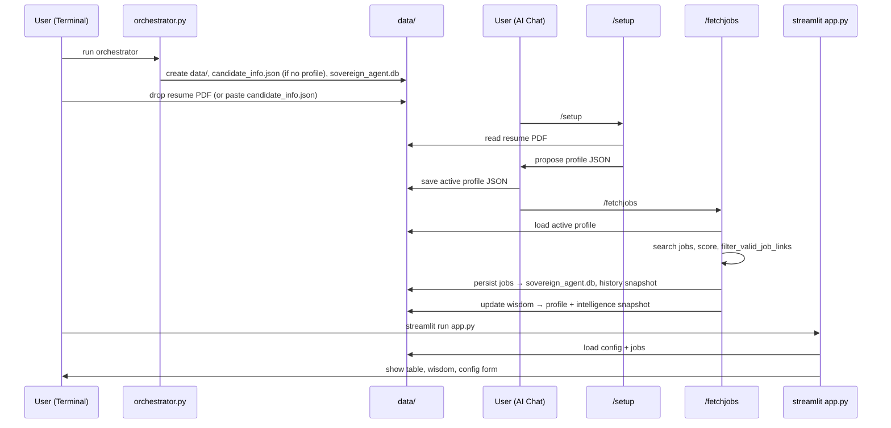

# Career Command Center

Standalone, self-sufficient autonomous job-search package. Follow the steps below. Use **terminal** for the orchestrator and app; use **AI Chat** (Cursor or Claude Code) for setup and job search.

---

## Table of Contents
- [Workflow: How To Run?](#workflow)
- [Project Layout: Key Components](#project-layout)
  - [Key components](#project-layout)
  - [Candidate profile JSON](#candidate-profile-json)
  - [Sequence](#flow-sequence)
- [Maintenance/Troubleshooting: after-setup + snapshot history + resetting](#maintenance)
  - [Maintenance/Troubleshooting: After setup](#after-setup)
  - [Maintenance/Troubleshooting: Snapshot history](#snapshot-history)
  - [Maintenance/Troubleshooting: Resetting](#resetting)
- [How to distribute](#how-to-distribute-this-repo)

## <a id="workflow"></a>Workflow: How To Run?

Quick clickable guide: [How to Run](./HOW_TO_RUN.md)

### 1. Initialize the environment (terminal)

In the **system terminal** (not the AI chat window), from the project root run:

```bash
python3 orchestrator.py
```

Or with **uv**:

```bash
uv run python orchestrator.py
```

This creates `data/`, an empty **`data/candidate_info.json`** template (only if no profile file exists yet), and the jobs database. **Safe to run multiple times:** existing profile JSON and DB data are not overwritten.

### 2. Drop resume

Place the resume PDF in the `data/` folder. Use any filename that **contains "resume"** (e.g. `data/resume.pdf`, `data/My_Resume.pdf`). Only PDFs whose name includes "resume" are used for setup.

### 3. Run one-time Setup (infer profile) — AI Chat

**In Cursor:** Open Cursor Chat (Cmd+L / Ctrl+L) and type **`/setup`**. The agent will read the resume, infer the profile, and show proposed JSON for approval. Save to `data/candidate_info.json` (preferred).

**In Claude Code:** Type **`/setup`** in the chat. The agent will read the resume, infer the profile, and show proposed JSON for approval. Save to `data/candidate_info.json`. Do not run the job search until the user has confirmed the config.

**Alternative:** Skip LLM setup and **copy the JSON** into `data/candidate_info.json` (see schema in the setup rule).

### 4. Run the search — AI Chat

**In Cursor:** Type **`/fetchjobs`**.

**In Claude Code:** Type **`/fetchjobs`** in the chat (load active profile, search, score, **validate links**, persist jobs, update `wisdom`).

`/fetchjobs` now includes a dedicated LinkedIn path and logs:
- `linkedin_discovered`
- `linkedin_with_ats`
- `linkedin_fallback_only`
- `linkedin_dropped_reason_counts`

### 4b. Listing URL validation (trust model)

- **Automatic (happens during `/fetchjobs`, no extra user action):** `filter_valid_job_links()` checks each candidate URL (HTTP 2xx, minimum body size, dead-page phrases, and title echo on non-LinkedIn boards) immediately before `persist_jobs()`. See **`src/job_finder/link_validation.py`**.
- **Automatic (agent audit when needed):** **`.cursor/skills/validate-job-links/SKILL.md`** — MCP web fetch + redirect/title checks for ambiguous cases. The user does not run this manually; the agent uses it internally when it decides it needs stricter verification.
- **Automatic LinkedIn retrieval path:** **`.cursor/skills/discover-linkedin-jobs/SKILL.md`** — dedicated high-precision query templates, strict LinkedIn URL filtering, login-wall/interstitial handling, confidence tiers, and ATS backfill (company+title → direct Lever/Greenhouse/Ashby/Workday link).

### 5. View and edit (terminal)

```bash
streamlit run app.py
```

Or: `uv run streamlit run app.py`

Use the sidebar **Candidate Configuration** to edit the profile and click **Update Profile** to save. Job table (link, score, theme, rationale, source, feedback), metrics, and Market Intelligence appear in the app.

Market Intelligence is rendered as a one-column bullet table (`Intelligence`), with each row as an independent insight.

---

## <a id="project-layout"></a>Project Layout: Key Components

| Path | What it’s for | Who is responsible |
|------|------------------|---------------------|
| `orchestrator.py` | Initializes `data/` and creates the jobs DB (if missing). | **User runs once** at the start (or after a reset). |
| `reset.py` | Clears config/jobs/snapshot history; writes a fresh empty `data/candidate_info.json`. | **User runs** only when starting over. |
| `data/candidate_info.json` | Your active candidate profile. | **User creates/edits** via `/setup` + the Streamlit “Update Profile” button. |
| `data/sovereign_agent.db` | Persisted jobs table. | **Auto**: written/updated during `/fetchjobs`. |
| `data/history/` | Append-only snapshots for profile/jobs/wisdom. | **Auto**: created during saves + `/fetchjobs` + wisdom updates. |
| `src/job_finder/config.py` | Load/save profile config. | **Auto** (internal). |
| `src/job_finder/candidate_disk_sync.py` | Detects external profile edits via sha256 fingerprint and snapshots on next `load_config`. | **Auto** (internal). |
| `src/job_finder/history.py` | Snapshot list/get helpers. | **Auto** (internal), or **optional** if the user inspects snapshots manually. |
| `src/job_finder/persistence.py` | Persists fetched jobs + keeps existing feedback/weights. | **Auto** (internal) during `/fetchjobs`. |
| `src/job_finder/link_validation.py` | `filter_valid_job_links` (HTTP + content + title checks). | **Auto**: run before persisting jobs in `/fetchjobs`. |
| `scripts/snapshot_history.py` | CLI to list snapshot metadata (optional). | **User runs optionally** for debugging/restore. |
| `scripts/dump_judge_context.py` | Creates evidence payload for the in-chat judge (optional). | **User runs** only when doing the optional judge step. |
| `scripts/evaluate_nudge_system.py` | Prints external-LMM judge prompts (optional). | **User runs optionally**. |
| `.cursor/skills/evaluate-nudge-and-wisdom/` | Agent judge for nudge + wisdom (optional QA). | **Auto inside the agent** when the user requests it (not manual). |
| `.cursor/skills/validate-job-links/` | Extra MCP web validation (used when the agent audits listings). | **Auto inside the agent** when needed (not manual). |
| `.cursor/rules/jobsearch.mdc` | `/fetchjobs` agent rule. | **User triggers** by typing `/fetchjobs` (agent runs internals automatically). |
| `.cursor/rules/setup_from_resume.mdc` | `/setup` agent rule. | **User triggers** by typing `/setup` (agent proposes JSON). |
| `app.py` | Streamlit UI: edit profile + set job feedback/weights. | **User runs** `streamlit run app.py`; updates happen when the user clicks buttons. |

### <a id="candidate-profile-json"></a>Candidate profile JSON (`candidate_info.json`)

- **Preferred file:** `data/candidate_info.json` — used automatically if it exists.
- The app and `job_finder.config.load_config()` resolve the active path via `job_finder.paths.resolve_active_config_path()`.
- **User can paste or drop a full JSON** with the usual keys (`core_identity`, `scientific_moat`, `engineering_stack`, `target_seniority`, `target_country`, `priority_domains`, `golden_keywords`, `search_targets`, `noise_keywords`, `wisdom`, etc.). As long as the shape matches the schema in `.cursor/rules/setup_from_resume.mdc`, it will load in the app and in `/fetchjobs` without re-running setup.

---

### <a id="flow-sequence"></a>Sequence



---

## <a id="maintenance"></a>Maintenance/Troubleshooting: after-setup + snapshot history + resetting

### <a id="after-setup"></a>After setup (rerun without full reset)

- **Edit profile:** In the app, **Update Profile** saves to the active JSON path.
- **Search again:** **`/fetchjobs`** merges new jobs; snapshots append under `data/history/`.
- **LLM judge / QA (in Cursor):** **`evaluate-nudge-and-wisdom`** — `uv run python scripts/dump_judge_context.py`, then judge **nudge + MCP link checks + wisdom** in chat.  
- **External LLM (optional):** `uv run python scripts/evaluate_nudge_system.py` prints copy-paste prompts for tools outside Cursor.

---

### <a id="snapshot-history"></a>Snapshot history (safe revert / programmatic diff)

Snapshots are append-only rows stored under `data/history/` in three separate SQLite DBs:

- Candidate profile snapshots (`data/history/candidate_history.db`)
  - created when `save_config(..., record_snapshot=True)` runs (e.g. app **Update Profile**)
  - and also when the user edits the active profile JSON directly on disk; on the next `load_config`, the app detects the external change by comparing the file's sha256 to `data/history/.candidate_profile_fingerprint.json`
- Jobs table snapshots (`data/history/jobs_history.db`)
  - created when `persist_jobs()` runs (e.g. after `/fetchjobs`)
- Wisdom / intelligence snapshots (`data/history/intelligence_history.db`)
  - created when `update_wisdom()` runs

| Database | Contents |
|----------|----------|
| `candidate_history.db` | Full profile JSON snapshots |
| `jobs_history.db` | Full jobs table as JSON per snapshot |
| `intelligence_history.db` | `wisdom` string per snapshot |

```bash
# List recent snapshot rows (latest 30)
uv run python scripts/snapshot_history.py candidate
uv run python scripts/snapshot_history.py jobs
uv run python scripts/snapshot_history.py intelligence

# Python API (inspect + load snapshots)
python3 - <<'PY'
from job_finder.history import list_snapshots, get_candidate_snapshot, get_jobs_snapshot

candidate_rows = list_snapshots("candidate", limit=5)
print("candidate snapshots:", candidate_rows)

if candidate_rows:
    latest_candidate_id = candidate_rows[0]["id"]
    candidate_payload = get_candidate_snapshot(latest_candidate_id)
    print("latest candidate snapshot keys:", sorted(candidate_payload.keys()) if candidate_payload else None)

jobs_rows = list_snapshots("jobs", limit=1)
print("jobs snapshots:", jobs_rows)

if jobs_rows:
    latest_jobs_id = jobs_rows[0]["id"]
    jobs_payload = get_jobs_snapshot(latest_jobs_id)
    print("latest jobs snapshot rows:", len(jobs_payload) if jobs_payload else None)
PY
```

---

### <a id="resetting"></a>Resetting (start over)

1. **Terminal:** `python3 reset.py` or `uv run python reset.py`  
   Clears **`data/history/*.db`**, removes **`data/candidate_info.json`** if present, writes empty **`data/candidate_info.json`**, deletes **`data/sovereign_agent.db`**. Resume PDF(s) are **not** deleted.
2. **Terminal:** Run `orchestrator.py` to recreate the DB.
3. **AI Chat:** **/setup** (or paste a new `candidate_info.json`), then **/fetchjobs**.

**In Cursor:** **`/reset`** runs the reset script (see `.cursor/rules/reset.mdc`).

---

## <a id="how-to-distribute-this-repo"></a>How to distribute

Before sharing: run `reset.py`, then ensure `data/*.pdf`, `data/sovereign_agent.db`, `data/candidate_info.json`, and `data/history/` are not committed (see `.gitignore`).
